# Chess (OOP) – Java Console Game

This project is a fully object-oriented implementation of **Chess** in Java.  
The game runs entirely in the console and focuses on applying:

- Object-Oriented Programming (OOP)
- Polymorphism
- Inheritance
- Encapsulation
- Board–Piece design principles

The system validates moves for all major chess pieces and updates the board after each move.

---

## **How to Play (Console Guide)**

1. Run the program:
   ```bash
   java com.chess.Main.Game
````

2. The game prints the board:

   ```
   8 R K B Q K B K R
   7 P P P P P P P P
   6 _ _ _ _ _ _ _ _
   5 _ _ _ _ _ _ _ _
   4 _ _ _ _ _ _ _ _
   3 _ _ _ _ _ _ _ _
   2 P P P P P P P P
   1 R K B Q K B K R
     A B C D E F G H
   ```

3. Enter moves using this format:

   ```
   E2->E4
   ```

   Meaning: move the piece from **E2** to **E4**.

4. After each move, the board refreshes and displays the updated state.

5. Illegal moves do nothing.
   (Movement boundaries and capture rules are enforced per piece.)

---

## **Features Implemented**

### ✔ Complete Piece Movement Logic

Each piece has its own movement rules:

* Pawn
* Rook
* Bishop
* Knight
* King
* Queen

Each class extends `AbstractPiece` and implements the `Movable` interface.

### ✔ Board–Piece Relationship

`Board` manages:

* Square grid (`Square[][]`)
* `Map<Location, Square>`
* Lists of light and dark pieces
* `movePiece(from, to)` for updating game positions

### ✔ Console Interaction

Very simple user input loop:

```java
String input = scan.nextLine(); // Example: "E2->E4"
```

---

# **UML Class Diagram**

## **1. Mermaid UML (GitHub renders automatically)**

```mermaid
classDiagram
    class Board {
        -Square[][] boardSquares
        -Map<Location, Square> locationSquareMap
        +printBoard()
        +movePiece(Square from, Square to)
    }

    class Square {
        -SquareColor squareColor
        -Location location
        -boolean isOccupied
        -AbstractPiece currentAbstractPiece
        +reset()
        +setCurrentAbstractPiece()
        +isOccupied()
    }

    class Location {
        -File file
        -int rank
    }

    class AbstractPiece {
        #String name
        #PieceColor pieceColor
        #Square currentSquare
        +getValidMoves()*
    }

    class Movable {
        <<interface>>
        +getValidMoves(Board)
        +isValidMove(Board, Location)
    }

    class Pawn
    class Rock
    class Knight
    class Bishop
    class Queen
    class King

    Board --> Square
    Board --> AbstractPiece
    Square --> AbstractPiece
    AbstractPiece <|-- Pawn
    AbstractPiece <|-- Rock
    AbstractPiece <|-- Knight
    AbstractPiece <|-- Bishop
    AbstractPiece <|-- Queen
    AbstractPiece <|-- King
    AbstractPiece ..|> Movable
```



---

## **2. ASCII UML Diagram (Console-Friendly)**

```
                 +-------------------+
                 |     Movable       |
                 |-------------------|
                 | +getValidMoves()  |
                 | +isValidMove()    |
                 +---------^---------+
                           |
                   +-------+--------+
                   | AbstractPiece  |
                   |----------------|
                   | name           |
                   | pieceColor     |
                   | currentSquare  |
                   +---^--^--^--^---+
                       |  |  |  |
   +---------+    +---------+   +-----------+
   |  Pawn   |    |  Rook   |   |  Bishop   |
   +---------+    +---------+   +-----------+
        ^                ^             ^
        |                |             |
   +-----------+    +----------+   +---------+
   |  Knight   |    |  Queen   |   |  King   |
   +-----------+    +----------+   +---------+


                 +--------------------+
                 |       Board        |
                 |--------------------|
                 | boardSquares[][]   |
                 | locationMap        |
                 | lightPieces        |
                 | darkPieces         |
                 +---------+----------+
                           |
                           v
                      +---------+
                      | Square  |
                      |---------|
                      | color   |
                      | location|
                      | piece   |
                      +---------+
```

---

# **Running the Project**

### **1. Compile**

Using VS Code:

* Press **Run**
* OR Open Java Projects sidebar → click **Build**

Manual command:

```bash
javac -d bin src/**/*.java
```

### **2. Run**

```bash
java -cp bin com.chess.Main.Game
```

---

# **Folder Structure**

```
Chess(OOP)/
│
├── src/
│   ├── com/chess/Main/Game.java
│   ├── com/chess/Board/Board.java
│   ├── com/chess/squares/Square.java
│   ├── com/chess/piece/*.java
│   ├── com/chess/common/*.java
│
├── bin/               # compiled classes
├── lib/               # (optional dependencies)
└── README.md
```

---

# **Future Improvements**

* Castling
* Check detection
* Checkmate detection
* En passant
* Pawn promotion
* Stalemate rules
* Move history & undo
* AI opponent
* GUI (JavaFX / Swing) version
* PGN file export

---

# **Author**

**Moshtaq Anwari**
University of Dayton
Chess (OOP) Java Personal Project for Practice
